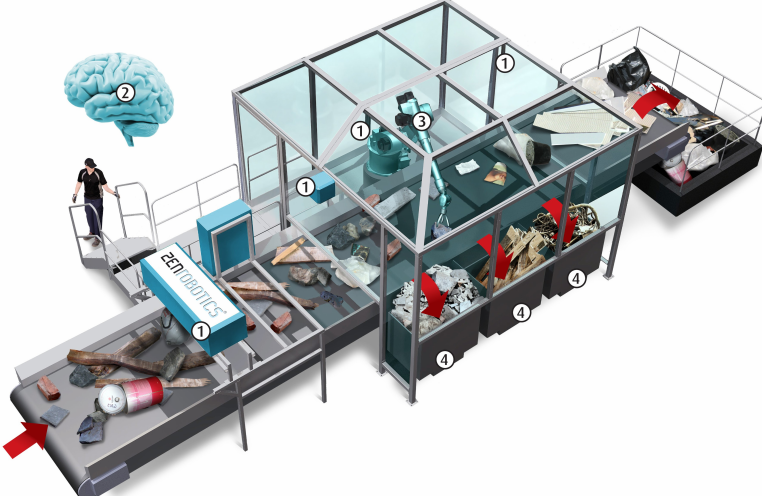
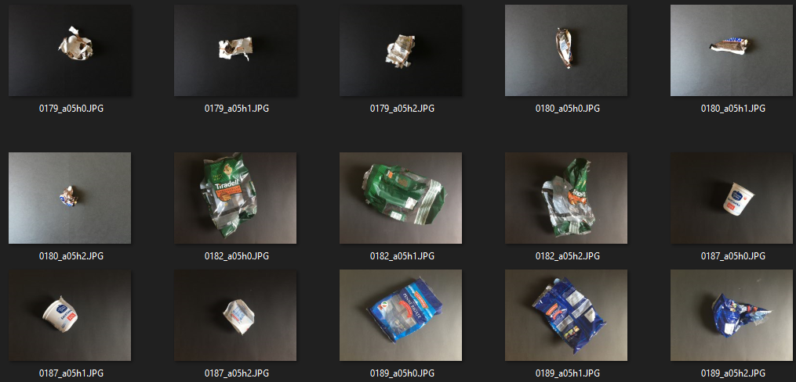
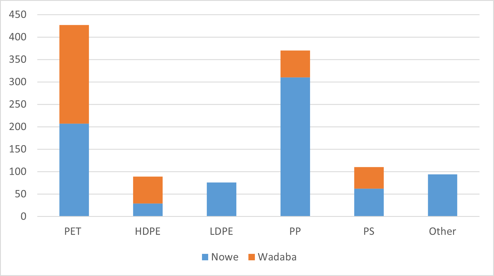

# B.Eng-Thesis-WaSoR
My engineering thesis project - A system for visual sorting plastic waste. I had used 2 machine learning algorithms to recognize between different types of plastic waste.

## Table of contents
* [General info](#general-info)
* [Technologies](#technologies)
* [Dataset](#dataset)
* [SVM - Support Vector Machine](#svm)
* [CNN - Convolutional Neural Network](#cnn)
* [Project summary](#project-summary)
* [Contact](#contact)

## General info
In recent years, several robotics companies(like [ZenRobotics](https://zenrobotics.com)) have developed a new system for waste management - Waste Sorting Robots(hence my abbreviation *WaSoR*). Combining robotic arms, computer vision and machine learning to segregate waste on a conveyor belt. Example of such system below:

This project is my take on creating such an application, starting from the crucial part - properly recognizing types of waste. My goal was to create a machine learning algorithm that distinguishes between different types of plastic trash.
I had used an international classification of:
* PET
* HDPE
* LDPE
* PP
* PS
* Other
* (PVC was excluded, as there weren't enough samples)

Researched ML algorithms: 
1. Support Vector Machines, with Bag of Features technique - A proven algorithm that achieved an average of 60% accuracy. Particularly effective with simple, uniform, classes.
2. Convolutional Neural Network with Transfer Learning - A modern approach that experimentally reached 90% accuracy. Challenging, but more promising classifier.

My full thesis, in Polish, is [here](./Thesis%20Final.pdf).

## Technologies
* Python 3.0
* Matlab R2017b
* Keras

## Dataset
My dataset consists of pictures of single pieces of plastic in the middle of a black background. It is a simplified version of real-life waste, moving on a conveyor belt. The idea of such representation comes from the [WaDaBa project](http://wadaba.pcz.pl/#home). \
After initial experiments, I decided to use only images from the WaDaBa with the "h0" appendix. The rest of the pictures seemed redundant, disrupted results. Apart from that, I expanded the database myself, by taking photographs of my household waste. Combing those 2 sources, I've created a database, which I called Plasor.\
[Main dataset directory.](./Dataset_Lean_h0/)\
Some example images, and the dataset summary on a graph:

Each plastic object had approximately 4 pictures taken, in different positions, and state(they were being gradually crumpled). It's worth noticing that classes PET and PP consist of about 100 objects, and the rest are represented with approximately 25 waste pieces per class. 

## SVM
Following the projects of [M. Yang and G. Thung](http://cs229.stanford.edu/proj2016/report/ThungYang-ClassificationOfTrashForRecyclabilityStatus-report.pdf), and [Sakr et. al.](https://ieeexplore.ieee.org/document/7777453), firstly I had researched the Support Vector Machine algorithm, with the Bag of Features technique. In addition, a 10-fold stratified crossvalidation was applied, to compensate uneven classes. 
I implemented it in Matlab(the Computer Vision Toolbox is required). Main script for SVM is [here](./SVM/SVM.m).

<!-- In a nutshell, bag of features learns K points(usually 500) from the training set images  -->

<!-- ## Very first exp -->

### Basic experiment
Na podstawowej bazie Plasor udało sie uzyskać

### Class optimization

Later on, I'd proposed different classes:
LDPE, HDPE, PETb, Misc

Zaś przy próbie optymalizacji klas:

## CNN
Ze względu na mały dataset, niektóre klasy po kilkadziesiąt zdjęć, wzorowałem się na artykułach krozsytających z Transfer Learning, jak Cumerwerwe, Xianjio. 
[Bircanoğlu et. al.](https://www.researchgate.net/publication/325626219_RecycleNet_Intelligent_Waste_Sorting_Using_Deep_Neural_Networks)

Na podstawowej bazie Plasor udało sie uzyskać

Zaś przy próbie optymalizacji klas:

## Project summary
Sorting plastic waste is a difficult issue. On one hand objects can be diverse within a single type, and on the other there are similarities between classes. Each algorithm, with different parameters, performs better or worse, under given conditions.

Ideas on how to improve recognition:
1. Redefining classes, creating groups like "cosmetics", "packaging films", etc.
2. Applying sensor fusion. Combining camera images with spectral analysis or tactile sensors.
3. Combination of different classifiers specialised in other classes.

## Contact
Created by [Filip Adamcewicz](https://www.linkedin.com/in/filippo011235/) - fadamcewicz1@gmail.com - feel free to contact me! 
