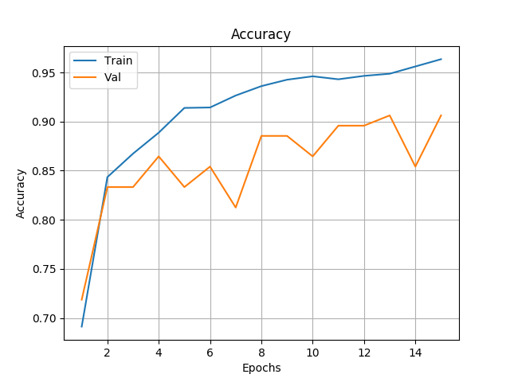

# B.Eng-Thesis-WaSoR
My engineering thesis project - A system for visual sorting plastic waste. I had used 2 machine learning algorithms to recognize between different types of plastic waste.

## Table of contents
* [General info](#general-info)
* [Technologies](#technologies)
* [Dataset](#dataset)
* [SVM - Support Vector Machine](#svm)
* [CNN - Convolutional Neural Network](#cnn)
* [Project summary](#project-summary)
* [Contact](#contact)

## General info
In recent years, several robotics companies, e.g. [ZenRobotics](https://zenrobotics.com), have developed a new system for waste management - Waste Sorting Robots(hence my abbreviation *WaSoR*). Combining robotic arms, computer vision and machine learning to segregate waste on a conveyor belt. Example of such system:

This project is my take on creating such an application, starting from the crucial part - properly recognizing types of waste. My goal was to create a machine learning algorithm that distinguishes between different types of plastic trash.
I had used an international classification of:
* *PET*
* *HDPE*
* *LDPE*
* *PP*
* *PS*
* *Other*
* (PVC was excluded, as there weren't enough samples)

Researched ML algorithms: 
1. Support Vector Machines, with Bag of Features technique - A proven algorithm that achieved an average of 60% accuracy. Particularly effective with simple, uniform, classes.
2. Convolutional Neural Network with Transfer Learning - A modern approach that experimentally reached 90% accuracy. Challenging, but more promising classifier.

My full thesis, in Polish, is [here](./Thesis%20Final.pdf).

## Technologies
* Python 3.0
* Matlab R2017b
* Keras

## Dataset
My dataset consists of pictures of single pieces of plastic in the middle of a black background. It is a simplified version of real-life waste, moving on a conveyor belt. The idea of such representation comes from the [WaDaBa project](http://wadaba.pcz.pl/#home). \
After initial experiments, I decided to use only images from the WaDaBa with the "h0" appendix. The rest of the pictures seemed redundant, disrupted results. Apart from that, I expanded the database myself, by taking photographs of my household waste. Combining those 2 sources, I've created a database, which I called Plasor.\
[Main dataset directory.](./Dataset_Lean_h0/)\
Some example images, and the dataset summary on a graph:

Each plastic object had approximately 4 pictures taken, in different positions, and state(they were being gradually crumpled). It's worth noting that classes *PET* and *PP* consist of about 100 objects, and the rest are represented with approximately 25 waste pieces per class. 

## SVM
I started with the classical machine learning approach. Following the projects of [M. Yang and G. Thung](http://cs229.stanford.edu/proj2016/report/ThungYang-ClassificationOfTrashForRecyclabilityStatus-report.pdf), and [Sakr et. al.](https://ieeexplore.ieee.org/document/7777453), I had researched the Support Vector Machine algorithm, with the Bag of Features technique. In addition, 10-fold stratified cross-validation was applied, to compensate for uneven classes. No data augmentation was applied.
The algorithm had been implemented in Matlab(the Computer Vision Toolbox is required). \
Main SVM script is [here](./SVM/SVM.m).

<!-- In a nutshell, bag of features learns K points(usually 500) from the training set images  -->

<!-- ## Very first exp -->

### Basic result
Using an unmodified Plasor dataset, the confusion matrix for SVM is:\

The *LDPE* and *HDPE* classes are the two least abundant, but best recognised. The accuracy with these types can be attributed to the fact that they are the most "homogeneous" classes in which objects have similar characteristics. Additionally, when the SVM performs an incorrect classification, it mostly selects these two types. Waste type
*PET* is particularly confused as *HDPE*. This is consistent in that among them there are several non-transparent bottles. *Other* and *PP* are confused with *LDPE*. It is worth to point out that these 3 classes share the possession of film packaging. \
To sum up, I concluded that uniformity, how objects are similar to each other within a class, determines the accuracy of recognition.

### Class optimisation
In various experiments, the most problematic classes were *PP*, *Other*, *PS*, and also *PET* caused some problems. This may be due to how diverse these groups are. 
Therefore, I decided to try to combine *PP*, *Other*, *PS*, and part of *PET* into a new class. From *PET* I subjectively selected 17 waste, deviating from the shape of the bottle. 
All these images were combined into a new class: *Misc*, from *Miscellaneous*. The remaining *PET* was renamed to *PETb*, from **PET* bottles*. \
When implementing such a system in a robotic application, the *Misc* class waste could be ignored and further passed through a conveyor belt.

Results after this attempt at class optimisation: \

The classifier recognises the *HDPE*, *LDPE* classes a few per cent better, while the efficiency for the *PETb* group increased by 14%. The accuracy at the *Misc* type is similar to the arithmetic mean accuracy from the separate *PP*, *PS*, *Other* classes. The slight improvement may be because the classifier avoids mistakes between these classes. However, still, every third picture is mistaken for *LDPE* and one in five for *HDPE*. Also, despite defining *PETb* as a "bottle class", there are objects in it misclassified as *LDPE*, or *Misc*. 
In summary, the redefinition, simplification, of classes has only helped a little in effective sorting.

## CNN
Due to the small size of the dataset, for deep learning, I used the transfer learning approach, based on the work of [Xu et. al.](https://www.preprints.org/manuscript/202002.0327/v1) and especially [Bircanoğlu et. al.](https://www.researchgate.net/publication/325626219_RecycleNet_Intelligent_Waste_Sorting_Using_Deep_Neural_Networks).

Main script can be found [here](./CNN%20with%20TL/DenseFull.py).

### CNN implementation
Using Python and the Keras library, I started with the convolutional part of the DenseNet121 trained on the ImageNet dataset. After initial experiments, 4 layers were added on top of that:
1. Flatten 
2. Dense with 64 units and ReLu activation
3. Dropout with a parameter of 0.1
4. Dense output layer, with units depending on the number of classes(6 or 4) and a softmax activation function

Top layers displayed using `model.summary()`:\

The loss function was calculated with cross-entropy, and the Adam optimiser was used, with a learning rate factor of 0.0001. The batch size was set to 32.

Like with SVM, 10-fold stratified cross-validation was used. Due to practical considerations, and lack of time, experiments were conducted only for 15 epochs.

Using `ImageDataGenerator`, training images were randomly rotated within a 180-degree range, flipped vertically or horizontally, and subjected to a shear transformation for up to 15 degrees. The validation images were not processed. 

### Basic experiment
On the basic Plasor dataset, the average accuracy across folds was 73%. Accuracy, loss and confusion matrix for an example fold:

The fluctuating values for the validation set may be due to the small number of samples(most classes are represented by about 10 images). It is also likely that some hyperparameters and architecture are not optimised.

In the first experiment, under the same conditions, the CNN performed better than the SVM, in every class except *HDPE* and *PS*. However, the confusion of *HDPE* objects with, the more numerous, *PET* class is not surprising. The network has learned more examples, is biased towards *PET*, and these two classes share non-transparent bottles.
A similar phenomenon occurs between *PS* and the more numerous *PP*, which share many similar objects. The worst performing class is *Other*, confused with *LDPE* and *PP*.

### Class optimisation
In the second experiment, I performed network training on the modified Plasor set. The attempt to optimising classes from SVM was repeated - combining *Other*, *PP*, *PS* and part of *PET* into *Misc* class and the rest of *PET* into *PETb*. The accuracy improved to 87%.

The class optimisation proposal resulted in an approximately 15% improvement in classification accuracy. The resulting graphs were smoother in shape than in the previous experiment.

The recognition of *HDPE* and *LDPE* had been most affected by the change. Due to their small numbers, these classes are tested on about nine images. Therefore, misclassification of e.g. only 4 images translates into a 50% error. \
*PETb*, despite being defined as a class of bottles, still has 10% wrongly considered being *Misc*. On the other hand, the *Misc* class achieved an accuracy of 93%. This shows the effectiveness of such a fusion, at least during the initial stages of the project.

### Equalisation and optimisation of classes
The last experiment was performed on a Plasor dataset with modified classes and equalized number of images per class. Each image from the training set of *HDPE*, *LDPE* and *PETb* classes was duplicated 6, 7 and 1 time respectively. The images in the validation set were left unchanged. Now, the *HDPE*, *LDPE* and *Misc* classes had approximately 560 images, while *PETb* had 660. Due to the increased number of images of the same waste shots, the parameters of the classifier model were changed. The Dropout layer factor was set to 0.2 to prevent overfitting. The average accuracy reached 90%.\

In spite of the increase in the Dropout layer parameter, overfitting still increased relative to previous experiments.

Multiplying the data resulted in better accuracy in all classes, apart from a slight deterioration in *Misc*. These results would still need to be confronted with classifying new objects. However, the method of equalization seems to help with smaller classes.

## Project summary
Sorting plastic waste is a difficult issue. On one hand objects can be diverse within a single type, and on the other there are similarities between classes. Each algorithm, with different parameters, performs better or worse, under given conditions.

Ideas on how to improve recognition:
1. Redefining classes, creating groups like "cosmetics", "packaging films", etc.
2. Applying sensor fusion. Combining camera images with spectral analysis or tactile sensors.
3. Combination of different classifiers specialised in other classes.

## Contact
Created by [Filip Adamcewicz](https://www.linkedin.com/in/filippo011235/) - fadamcewicz1@gmail.com - feel free to contact me! 
